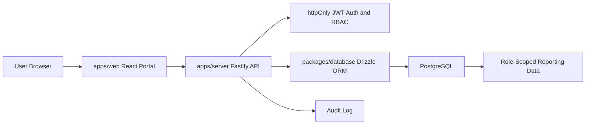

# Architecture

## Current Prototype

## Principles

- The web app is a role-scoped operating surface, not a public landing page.
- The server validates identity, permissions, and organization scope on every protected endpoint.
- The database stores master records, workflow records, and audit history as structured data.
- Documents and exports are future secure-storage surfaces; they should never bypass audit controls.

## Deployment Shape

- Web bundle: Cloudflare Pages, using `apps/web/wrangler.jsonc`.
- Server: Node host for this prototype. Can move to Workers only after the database/auth decision is locked.
- Database: PostgreSQL locally through `docker-compose.yml`; production target is still open in `SOLD.md`.
