# Central Programme Management Portal — Technical PRD & System Overview

**Version:** v0.1 Draft  
**Document Type:** Technical Product Requirements Document  
**Purpose:** Define the software system required to centrally manage a multi-stakeholder programme involving governance teams, committees, programme teams, incubators, schools, students, mentors, curriculum, resources, projects, funding, monitoring, reporting and administration.  
**Important Note:** This document does **not** describe the scheme itself. It only defines the software platform required to manage such a programme.

---

## 1. Executive Summary

The proposed platform is a centralized web application that acts as the single source of truth for all operational, administrative, academic, governance and monitoring activities related to the programme.

The portal will replace disconnected spreadsheets, emails, WhatsApp groups, manual reporting and scattered documents with one secure, auditable and scalable system.

The platform will support:

- User and role management
- Committee and governance management
- People directory
- Incubator management
- School management
- Student management
- Curriculum and resource management
- Project and innovation tracking
- Mentor and expert engagement
- Industry and funding partner management
- Dashboards and reporting
- Document repository
- Approval workflows
- Audit logs
- Monitoring and evaluation
- Secure data access

The portal should be built as a government-grade, scalable, secure and role-based digital management system.

---

## 2. Product Vision

To create a secure and scalable digital operating system for managing a large multi-stakeholder programme from one central platform.

The system should allow every authorized stakeholder to access the right data, perform the right action, and monitor the right outcomes according to their role.

---

## 3. Product Objectives

### 3.1 Operational Objectives

- Centralize all programme data.
- Track institutions, users, students, projects and resources.
- Reduce manual reporting.
- Improve accountability.
- Enable real-time monitoring.
- Maintain accurate records.
- Provide a structured workflow for every major activity.

### 3.2 Governance Objectives

- Provide committee-level visibility.
- Track meetings, decisions and action items.
- Maintain official documentation.
- Support approvals and review workflows.
- Create audit-ready governance records.

### 3.3 Student-Facing Objectives

- Allow students to access curriculum and resources.
- Allow students to submit project work.
- Allow students to receive feedback.
- Track student progress and achievements.
- Provide certificates or recognition records.

### 3.4 Security Objectives

- Protect sensitive data.
- Enforce role-based access.
- Maintain audit logs.
- Secure documents and reports.
- Prevent unauthorized exports.
- Support government-grade compliance practices.

---

## 4. Core Problem Statement

The programme requires a centralized software system because large-scale multi-stakeholder initiatives often suffer from:

- Multiple disconnected spreadsheets
- Manual follow-ups
- No single source of truth
- No real-time dashboards
- Unclear user responsibilities
- Weak document control
- No formal audit trail
- No structured student lifecycle
- No standard reporting system
- No secure access management
- No clear visibility across incubators and schools
- Difficulty scaling from pilot to state/national level

The software must solve these problems by creating one structured, secure and scalable portal.

---

## 5. Scope of the Platform

## 5.1 In Scope

The portal should include:

1. Authentication and identity management
2. Role-based access control
3. User and people directory
4. Organization hierarchy management
5. Committee management
6. Meeting and minutes management
7. Incubator management
8. School management
9. Student management
10. Teacher/champion management
11. Mentor/expert management
12. Curriculum and resource library
13. Project tracking
14. Problem statement management
15. Event and activity management
16. Partner management
17. Funding/grant tracking
18. Document repository
19. Task and action item management
20. Dashboards
21. Reports
22. Notifications
23. Audit logs
24. Admin configuration
25. Data import/export

## 5.2 Out of Scope for MVP

The first version should not try to include everything. These can be future features:

- Full native mobile app
- AI mentor chatbot
- Advanced AI analytics
- Offline-first field app
- Biometric attendance
- Payment gateway
- Full LMS exam engine
- Public open-data website
- Video conferencing inside the app

## 5.3 Review-Level System Blueprint

The platform should be understood as a controlled operating layer between programme stakeholders, institutional data, learning/project operations and governance reporting. The diagram below shows the expected review-level shape of the product.

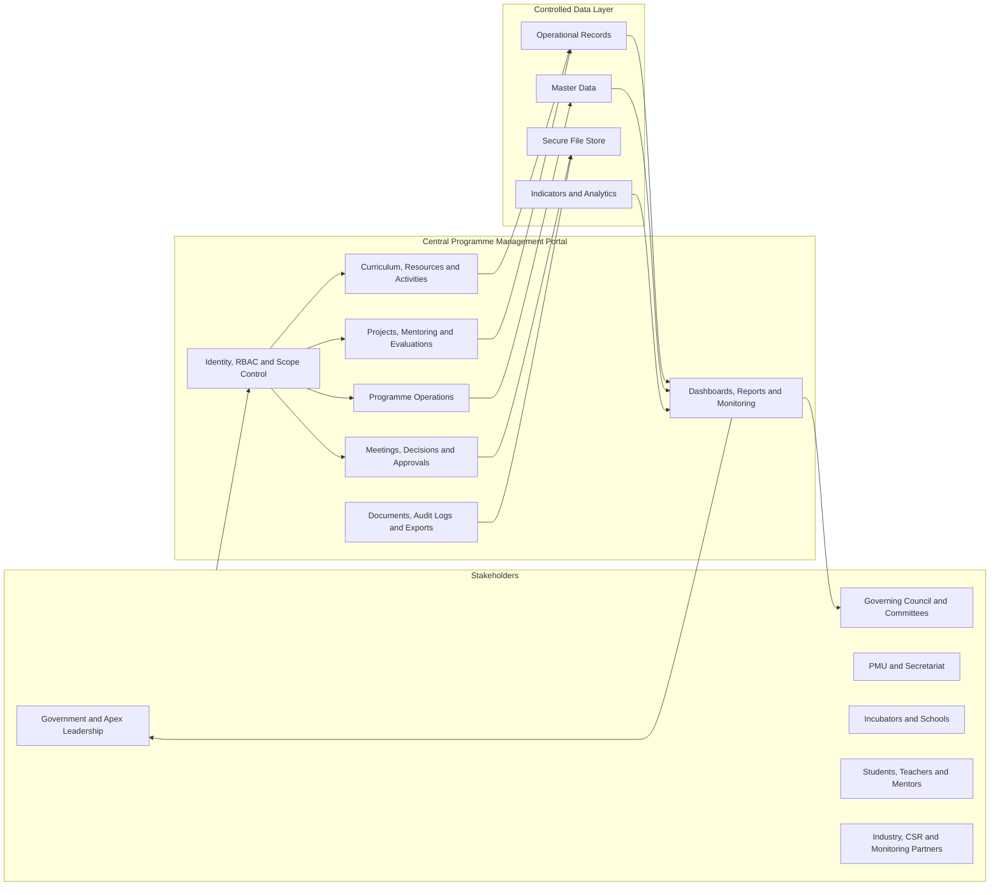

### Reviewer Takeaways

- The portal is not only a data-entry system; it is a controlled workflow, evidence and reporting system.
- Every action should be linked to a role, scope, institution and audit trail.
- Dashboards should be fed from structured operational records, not from manually uploaded summary spreadsheets.
- The MVP should prioritize reliable master data, RBAC, workflows, reporting and document control before advanced intelligence features.

### MVP Priority Map

| Priority | Capability Area | Why It Matters | MVP Expectation |
|---|---|---|---|
| P0 | Identity, RBAC and scoped access | Protects sensitive programme and student data | Role, permission and organization scope enforced in every backend API |
| P0 | Master data and hierarchy | Creates the single source of truth | Clean records for users, roles, regions, incubators, schools and students |
| P0 | Core operations | Enables day-to-day execution | Incubator, school, student, curriculum, activity and project modules usable by assigned roles |
| P0 | Governance workflows | Makes decisions traceable | Meetings, minutes, decisions, approvals and action items with audit history |
| P0 | Dashboards and reports | Supports leadership monitoring | Role-based programme, institution, project and indicator dashboards |
| P1 | Document repository | Preserves evidence and official records | Secure upload, tagging, versioning, access control and export controls |
| P1 | Notifications | Reduces manual follow-up | In-app and email notifications for approvals, assignments, reminders and escalations |
| P1 | Data import/export | Supports rollout and reporting | Validated imports, approved exports and export audit logs |
| P2 | Advanced analytics and AI | Improves intelligence after data maturity | Deferred until trusted operational data is available |

### Review Checklist

- Confirm the listed user roles match the real operating model.
- Confirm which workflows require maker-checker approval in MVP.
- Confirm the minimum dashboard indicators required for launch.
- Confirm student data privacy, export restrictions and retention expectations.
- Confirm whether integrations are required in MVP or can remain future-ready.
- Confirm which reports must be downloadable for official review meetings.

### Open Decisions for Stakeholders

| Decision Area | Question to Resolve | Suggested Owner |
|---|---|---|
| Role hierarchy | Can one user hold multiple active roles across institutions? | PMU and IT Tool Team |
| Data visibility | Which leadership dashboards should show aggregated-only student data? | Government/Apex Leadership |
| Approval policy | Which modules need single approval vs maker-checker approval? | PMU and Secretariat |
| Reporting cadence | Which reports are monthly, quarterly and event-triggered? | PMU and Monitoring Team |
| Document control | Which document types require versioning and retention rules? | Secretariat and Legal/Admin |
| Rollout approach | Should schools be onboarded by region, incubator cluster or programme cohort? | PMU |

---

## 6. User Types

The system will have multiple user types. One person may have more than one role.

---

## 6.1 Super Admin

### Purpose

Technical owner of the platform.

### Responsibilities

- Configure the system
- Manage all users
- Manage roles and permissions
- Configure security settings
- Manage integrations
- Monitor system health
- View audit logs
- Manage backups and environment settings

### Access Level

Full platform access.

---

## 6.2 Government / Apex Leadership User

### Purpose

High-level monitoring and decision-making.

### Responsibilities

- View dashboards
- Track programme health
- Review reports
- View governance updates
- Monitor risks
- Track impact indicators

### Access Level

Mostly read-only access with some approval rights if required.

---

## 6.3 Governing Council Member

### Purpose

Strategic oversight.

### Responsibilities

- View committee documents
- Review meeting agendas
- Review minutes
- Approve strategic decisions
- Track major action items
- View progress reports

### Access Level

Governance-level read/comment/approve access.

---

## 6.4 Steering Committee Member

### Purpose

Operational governance and review.

### Responsibilities

- Review PMU updates
- Track implementation status
- Approve operational decisions
- View risks and escalations
- Monitor action items

### Access Level

Read, comment and approve access for assigned governance areas.

---

## 6.5 PMU Admin

### Purpose

Central operational administrator.

### Responsibilities

- Manage programme data
- Create institutions
- Add incubators and schools
- Assign users
- Monitor execution
- Generate reports
- Manage workflows
- Track tasks
- Coordinate with all teams

### Access Level

Full programme-level operational access.

---

## 6.6 PMU Team Member

### Purpose

Day-to-day execution.

### Responsibilities

- Update programme progress
- Manage assigned regions or clusters
- Track incubators and schools
- Review reports
- Upload documents
- Follow up on action items

### Access Level

Create/update access for assigned areas.

---

## 6.7 Central Secretariat User

### Purpose

Governance coordination and documentation.

### Responsibilities

- Manage meeting calendars
- Prepare agendas
- Upload minutes
- Track decisions
- Track action items
- Send official updates
- Maintain committee documents

### Access Level

Access to committees, meetings, documents and action items.

---

## 6.8 IT Tool Team User

### Purpose

Technical product support.

### Responsibilities

- Support users
- Manage configuration
- Track bugs
- Handle data imports
- Monitor usage
- Coordinate feature requests

### Access Level

Technical support access, but restricted from sensitive data unless required.

---

## 6.9 Programme Team User

### Purpose

Programme execution and content operations.

### Responsibilities

- Manage curriculum
- Manage interventions
- Track execution calendar
- Coordinate schools and incubators
- Monitor student participation
- Review field progress

### Access Level

Operational access to programme execution modules.

---

## 6.10 Industry Collaboration and Funding User

### Purpose

Manage partners, funding and challenge/problem statements.

### Responsibilities

- Maintain partner database
- Track funding opportunities
- Upload proposals and MoUs
- Manage problem statements
- Track sponsored activities
- Track funding commitments

### Access Level

Access to partner, funding and problem statement modules.

---

## 6.11 Incubator Admin

### Purpose

Manage one incubator and its mapped schools.

### Responsibilities

- Manage incubator profile
- Manage schools under incubator
- Manage mentors
- Track projects
- Schedule workshops
- Submit reports
- Review student submissions

### Access Level

Full access to assigned incubator and mapped schools.

---

## 6.12 Incubator Staff

### Purpose

Operational staff for incubator-level activities.

### Responsibilities

- Manage workshops
- Track school progress
- Support mentors
- Upload activity reports
- Review project submissions
- Maintain lab/resource records

### Access Level

Create/update access within assigned incubator.

---

## 6.13 School Admin / Principal

### Purpose

Manage school-level participation.

### Responsibilities

- Update school profile
- Approve teachers
- View students
- Track participation
- Submit school reports
- View curriculum calendar
- Track activities

### Access Level

Access limited to own school.

---

## 6.14 Teacher / Champion

### Purpose

Guide students and manage school-level learning activities.

### Responsibilities

- Add or verify students
- Create student groups
- Assign resources
- Track student progress
- Upload project updates
- Review student submissions
- Coordinate with mentors

### Access Level

Access to assigned school, students, curriculum and projects.

---

## 6.15 Student

### Purpose

Access learning content and participate in activities/projects.

### Responsibilities

- View curriculum
- Access resources
- Join activities
- Create or join projects
- Submit work
- Receive feedback
- Track progress
- Download certificates

### Access Level

Access only to own profile, assigned learning content and own project/team.

---

## 6.16 Mentor / Expert

### Purpose

Support students, teachers or projects.

### Responsibilities

- View assigned projects
- Give feedback
- Review submissions
- Attend mentoring sessions
- Upload notes
- Evaluate work

### Access Level

Access only to assigned students/projects/events.

---

## 6.17 Industry Partner

### Purpose

External organization user.

### Responsibilities

- Submit problem statements
- Assign mentors
- View related projects
- Provide feedback
- Track sponsored activities
- View partner-specific reports

### Access Level

Access limited to own organization and associated work.

---

## 6.18 Funding Partner / CSR User

### Purpose

Track funded activities and impact.

### Responsibilities

- View funded components
- Track utilization
- View reports
- Upload grant documents
- Download impact reports

### Access Level

Access limited to funded components.

---

## 6.19 Monitoring and Evaluation User

### Purpose

Evaluate programme performance.

### Responsibilities

- View indicator data
- Access reports
- Upload evaluation documents
- Export approved datasets
- Compare institutions
- Track outcomes

### Access Level

Read/export access to approved reporting datasets.

---

## 6.20 Public Viewer

### Purpose

Optional future public-facing user.

### Responsibilities

- View public reports
- View approved impact stories
- View public dashboards

### Access Level

No access to private data.

---

# 7. User Access Matrix

Legend:

- **N** = No Access
- **R** = Read
- **C** = Create
- **U** = Update
- **D** = Delete
- **A** = Approve
- **E** = Export
- **M** = Manage / Configure

| Module | Super Admin | Leadership | GC | Steering | PMU Admin | PMU Team | Secretariat | IT Team | Programme Team | Industry/Funding Team | Incubator Admin | School Admin | Teacher | Student | Mentor | Industry Partner | Funding Partner | M&E |
|---|---|---|---|---|---|---|---|---|---|---|---|---|---|---|---|---|---|---|
| System Settings | M | N | N | N | R | N | N | M | N | N | N | N | N | N | N | N | N | N |
| User Management | M | R | R | R | M | U | R | M | U | U | U | U | R | N | N | N | N | N |
| Role Management | M | N | N | N | M | N | N | M | N | N | N | N | N | N | N | N | N | N |
| Committee Management | M | R | R/A | R/A | C/U/A/E | R/U | C/U | R | R | R | N | N | N | N | N | N | N | R |
| Meeting Management | M | R | R/A | R/A | C/U/A/E | C/U | C/U | N | R/U | R | R | N | N | N | N | N | N | R |
| Action Items | M | R | R/A | R/A | C/U/A/E | C/U | C/U | N | C/U | C/U | C/U | R/U | R/U | R | R/U | R | R | R |
| Incubator Management | M | R | R | R | C/U/A/E | C/U | R | R | R/U | R | U | N | N | N | N | N | N | R |
| School Management | M | R | R | R | C/U/A/E | C/U | R | R | R/U | R | C/U | U | R | N | N | N | N | R |
| Student Management | M | Aggregated R | Aggregated R | Aggregated R | C/U/E | C/U | N | N | R/U | N | R/U | R/U | C/U | R/U Own | R Assigned | N | N | R/E |
| Curriculum Management | M | R | R | R | C/U/A/E | R/U | N | N | C/U | N | R/U | R | R | R | R | N | N | R |
| Resource Library | M | R | R | R | C/U/A/E | C/U | R | N | C/U | C/U | C/U | R/U | R | R | R | R | R | R |
| Project Tracking | M | Aggregated R | Aggregated R | Aggregated R | C/U/E | C/U | N | N | C/U | R | C/U | R/U | C/U | C/U Own | R/U Assigned | R Assigned | R Funded | R/E |
| Problem Statements | M | R | R | R | C/U/A/E | R/U | N | N | R/U | C/U/A | R | R | R | R | R | C/U Own | R | R |
| Mentor Management | M | R | R | R | C/U/E | C/U | N | N | C/U | C/U | C/U | R | R | N | U Own | U Own Org | N | R |
| Partner Management | M | R | R | R | C/U/A/E | R/U | N | N | R | C/U/A/E | R | N | N | N | N | U Own | R | R |
| Funding Management | M | Aggregated R | R | R | C/U/A/E | R/U | N | N | R | C/U/A/E | R | N | N | N | N | R Own | R/U Own | R/E |
| Reports | M | R/E | R/E | R/E | C/U/E | C/U/E | R/E | R | C/U/E | C/U/E | C/U/E | C/U/E | R/U | R Own | R Assigned | R Own | R Own | C/U/E |
| Dashboards | M | R | R | R | R | R | R | R | R | R | R | R | R | R Own | R Assigned | R Own | R Own | R |
| Document Repository | M | R | R | R | C/U/A/E | C/U | C/U | N | C/U | C/U | C/U | C/U | R/U | R | R Assigned | R Own | R Own | R/E |
| Audit Logs | M | R | R | R | R/E | N | N | R/E | N | N | N | N | N | N | N | N | N | R/E |
| Data Export | M | R/E | R/E | R/E | E | E | E | N | E | E | E Limited | E Limited | N | N | N | E Own | E Own | E |
| Notifications | M | R | R | R | C/U | C/U | C/U | N | C/U | C/U | C/U | C/U | R | R | R | R | R | R |

---

# 8. User Flows

The portal has many role-specific journeys, but all journeys should follow the same operational pattern: authenticate, apply role and scope, perform work in the assigned module, submit or approve evidence, notify the next stakeholder, and update dashboards/audit logs.

## 8.0 End-to-End Programme Flow

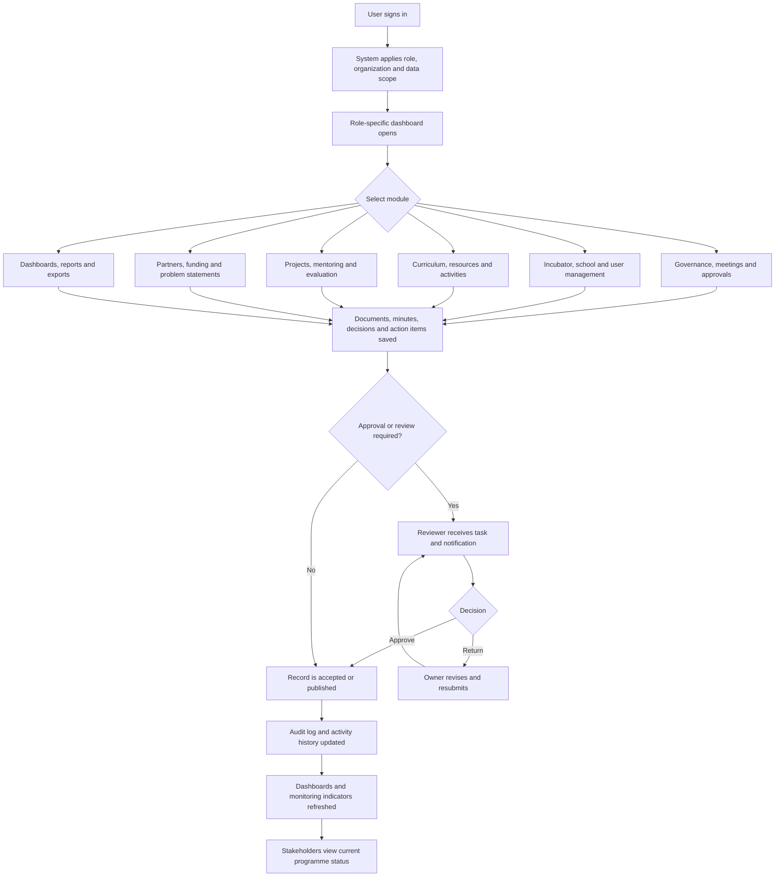

## 8.0.1 Cross-Role Handoff Flow

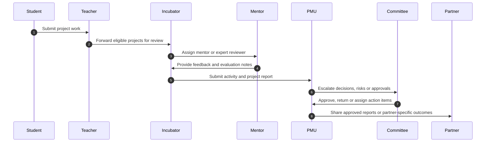

## 8.1 PMU Admin Flow

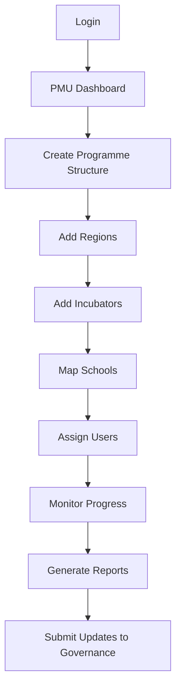

## 8.2 Committee Flow

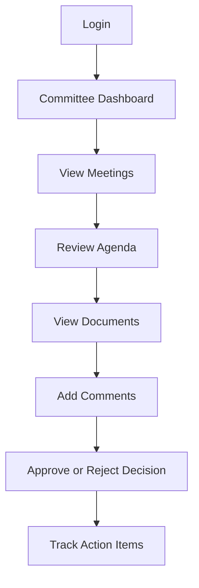

## 8.3 Secretariat Flow

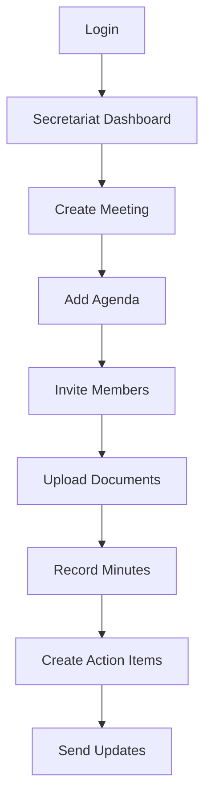

## 8.4 Incubator Admin Flow

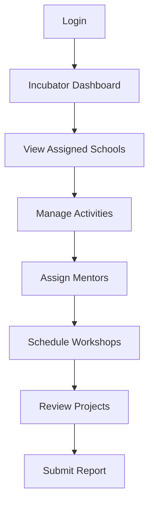

## 8.5 School Admin Flow

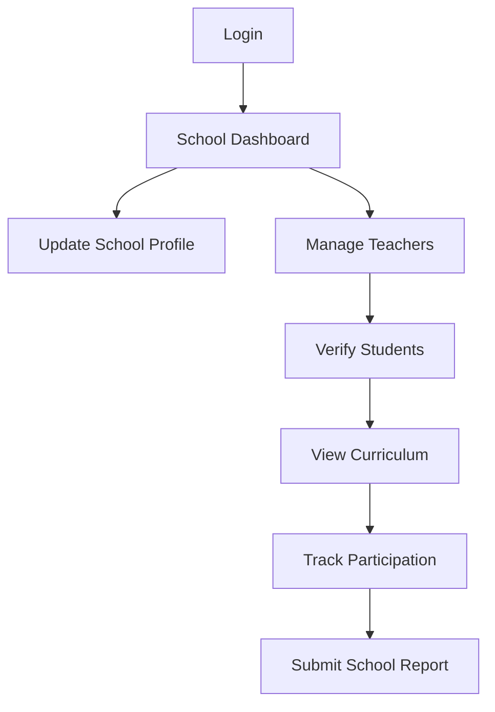

## 8.6 Teacher Flow

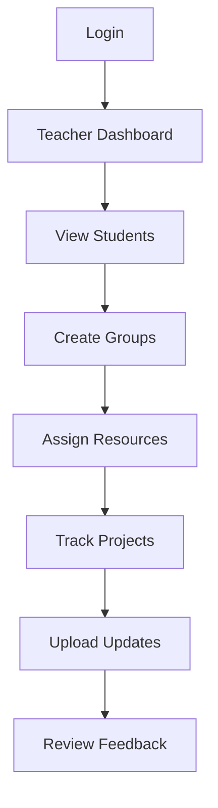

## 8.7 Student Flow

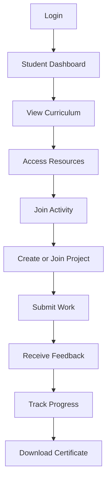

## 8.8 Mentor Flow

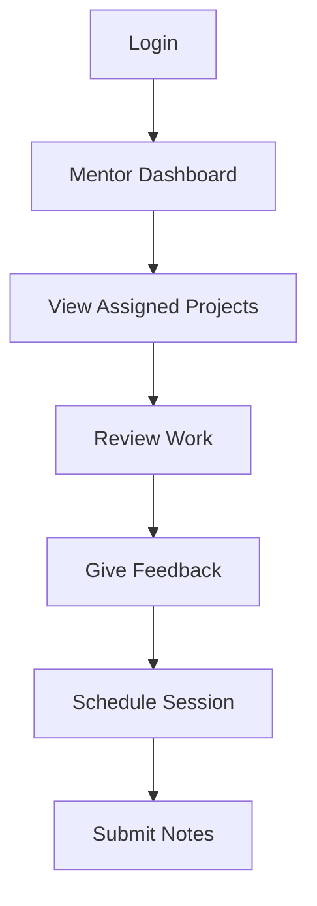

## 8.9 Industry Partner Flow

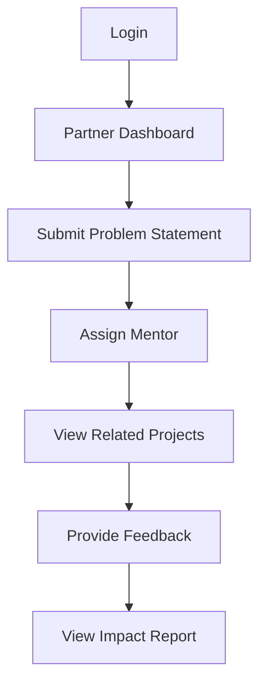

## 8.10 Funding Partner Flow

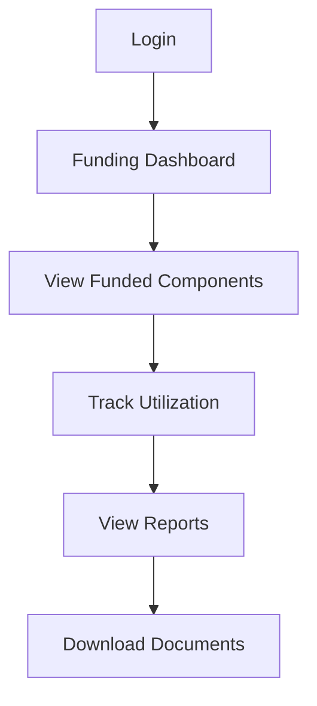

## 8.11 M&E Flow

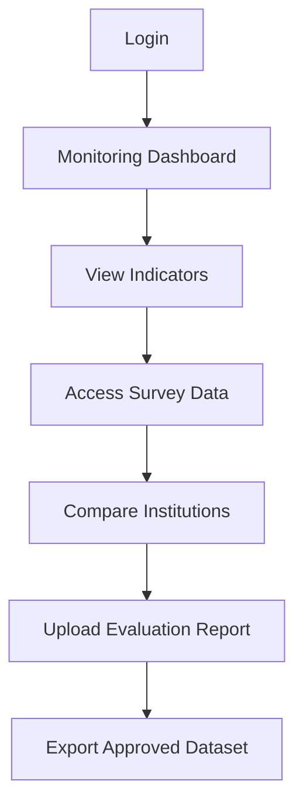

---

# 9. Core Product Modules

## 9.1 Authentication and Identity Management

### Features

- Secure login
- Password reset
- Multi-factor authentication
- Single sign-on readiness
- Session management
- Account lockout
- Login history
- User activation/deactivation

### Requirements

- MFA mandatory for admin and governance users.
- Password policies must be configurable.
- User sessions must expire after inactivity.
- Login attempts must be logged.

---

## 9.2 Role-Based Access Control

### Features

- Predefined roles
- Custom roles
- Permission groups
- Organization-level scoping
- Region-level scoping
- Institution-level scoping
- Project-level scoping
- Temporary elevated access
- Access review reports

### Requirements

- Permissions must be enforced at backend level.
- UI hiding is not enough.
- All permission changes must be logged.
- Every data access API must check both role and scope.

---

## 9.3 Organization Hierarchy Management

### Features

- Create national, regional and institutional hierarchy
- Map incubators to regions
- Map schools to incubators
- Map students to schools
- Assign users to organizational units
- View hierarchy tree
- Bulk upload hierarchy

---

## 9.4 Committee Management

### Features

- Committee creation
- Member assignment
- Meeting calendar
- Agenda creation
- Minutes of meeting
- Decision register
- Voting/approval
- Action item assignment
- Document attachments
- Historical archive

---

## 9.5 People Directory

### Features

- Central profile for every person
- Role mapping
- Organization mapping
- Contact details
- Status
- Assigned responsibilities
- Activity history
- Search and filters
- Import/export

---

## 9.6 Incubator Management

### Features

- Incubator profile
- Assigned schools
- Staff users
- Mentor pool
- Facility/resource records
- Activity calendar
- Workshop records
- Project review board
- Incubator reports
- Performance dashboard

---

## 9.7 School Management

### Features

- School profile
- School users
- Teacher/champion assignment
- Student records
- Curriculum access
- Activity calendar
- Reports
- Participation tracking
- Performance dashboard

---

## 9.8 Student Management

### Features

- Student profile
- Enrollment
- Guardian details where required
- School mapping
- Group/team assignment
- Learning progress
- Project participation
- Attendance if required
- Achievements
- Certificates
- Feedback history
- Alumni status

### Privacy Requirement

Student personal data must be strictly protected using role-based and institution-scoped access.

---

## 9.9 Curriculum and Resource Management

### Features

- Curriculum library
- Resource repository
- Grade-wise or cohort-wise content
- Topic-wise content
- Activity plans
- Downloadable files
- Videos or external links
- Version control
- Approval workflow
- Publishing workflow
- Access analytics

---

## 9.10 Project and Innovation Tracking

### Features

- Project creation
- Team formation
- Problem statement mapping
- Mentor assignment
- Milestone tracking
- Submission uploads
- Feedback
- Rubric-based evaluation
- Review status
- Demo selection
- Prototype status
- Incubation status

### Project State Flow

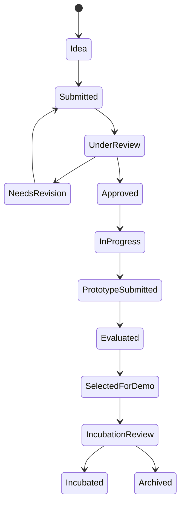

---

## 9.11 Problem Statement Management

### Features

- Problem statement submission
- Domain/category tagging
- Owner assignment
- Approval workflow
- Publishing workflow
- Project mapping
- Mentor mapping
- Status tracking

---

## 9.12 Mentor and Expert Management

### Features

- Mentor profile
- Expertise tags
- Availability
- Assigned projects
- Session notes
- Feedback history
- Evaluation forms
- Conflict of interest declaration

---

## 9.13 Event and Activity Management

### Features

- Event creation
- Registration
- Participant list
- Attendance
- Resource upload
- Feedback forms
- Certificates
- Event report
- Calendar integration

---

## 9.14 Industry Partner Management

### Features

- Partner profile
- Contact people
- MoU documents
- Problem statements
- Assigned mentors
- Sponsored activities
- Partner reports

---

## 9.15 Funding and Grant Management

### Features

- Funding partner profiles
- Grant records
- Fund allocation metadata
- Utilization tracking
- Supporting documents
- Milestone-based reporting
- Exportable summaries
- Audit trail

---

## 9.16 Document Repository

### Features

- Folder structure
- File upload
- Version control
- Access control
- Approval workflow
- Tags
- Search
- Expiry reminders
- Download logs
- Document classification

---

## 9.17 Task and Action Item Management

### Features

- Task creation
- Owner assignment
- Due date
- Priority
- Status
- Comments
- Attachments
- Escalation
- Reminders
- Completion evidence

---

## 9.18 Notification System

### Channels

- In-app
- Email
- SMS
- WhatsApp integration
- Push notifications in future

### Notification Types

- Task assigned
- Meeting reminder
- Approval requested
- Report due
- Report overdue
- Feedback received
- New resource published
- Event reminder
- Risk escalation

---

## 9.19 Audit Logs

### Events to Log

- Login/logout
- Failed login
- User creation
- Role changes
- Permission changes
- Document upload/download
- Record creation/update/deletion
- Approval/rejection
- Data export
- API access
- Admin setting changes

### Requirements

- Audit logs must be immutable.
- Logs must include timestamp, user, IP, device, action and affected entity.
- Logs must not be editable by normal admins.
- Logs must be searchable by authorized users.

---

# 10. Information Architecture

## 10.1 Top-Level Navigation

1. Dashboard
2. Governance
3. People
4. Institutions
5. Students
6. Learning
7. Projects
8. Events
9. Partners
10. Funding
11. Reports
12. Documents
13. Tasks
14. Notifications
15. Admin

## 10.2 Dashboard Sections

- My Dashboard
- National Overview
- State/Region Overview
- Incubator Overview
- School Overview
- Student Progress
- Project Pipeline
- Funding Overview
- Risk Overview

## 10.3 Governance Sections

- Committees
- Meetings
- Agendas
- Minutes
- Decisions
- Action Items
- Documents

## 10.4 Institution Sections

- Regions
- Incubators
- Clusters
- Schools
- Teachers
- Facilities

## 10.5 Learning Sections

- Curriculum
- Resources
- Assignments
- Activity Guides
- Templates
- Assessments

## 10.6 Project Sections

- All Projects
- My Projects
- Problem Statements
- Mentors
- Reviews
- Demo Days
- Incubation Pipeline

---

# 11. Dashboard Requirements

## 11.1 PMU Dashboard

Should show:

- Total schools
- Total incubators
- Total students
- Active projects
- Reports pending
- Action items pending
- Upcoming meetings
- Risk alerts
- Partner engagement
- Funding overview

## 11.2 School Dashboard

Should show:

- Enrolled students
- Active teachers
- Assigned curriculum
- Active projects
- Upcoming activities
- Reports due
- Student progress

## 11.3 Student Dashboard

Should show:

- Assigned curriculum
- Resources
- Project status
- Feedback
- Upcoming activities
- Achievements
- Certificates

## 11.4 Incubator Dashboard

Should show:

- Assigned schools
- Active mentors
- Active projects
- Workshops conducted
- Reports due
- Risk status

## 11.5 Leadership Dashboard

Should show:

- High-level KPIs
- Regional performance
- Funding summary
- Impact metrics
- Risk heatmap
- Governance action items

---

# 12. Reporting Requirements

## 12.1 Standard Reports

- User report
- Institution report
- Student report
- Project report
- Curriculum usage report
- Event report
- Mentor activity report
- Funding report
- Partner engagement report
- Committee action item report
- Risk report
- Audit report
- Monitoring and evaluation report

## 12.2 Report Features

- Filters
- Date ranges
- Region filters
- Institution filters
- Export to CSV
- Export to PDF
- Scheduled reports
- Role-based visibility
- Aggregated and detailed views

---

# 13. Recommended Technical Architecture

## 13.1 Architecture Type

The recommended architecture is a **modular monolith** for MVP, built with clear domain boundaries and deployed on cloud-native infrastructure.

This gives speed during MVP while allowing future migration to microservices.

## 13.2 Why Modular Monolith First

- Faster development
- Easier debugging
- Lower DevOps complexity
- Better consistency for workflows
- Easier deployment
- Easier testing
- Can be split into services later

## 13.3 Backend Modules

- Auth Module
- User Module
- RBAC Module
- Organization Module
- Committee Module
- Institution Module
- Student Module
- Learning Module
- Project Module
- Partner Module
- Funding Module
- Reporting Module
- Notification Module
- Document Module
- Audit Module
- Admin Module

## 13.4 Architecture Principles

- Keep MVP delivery simple with a modular monolith, but enforce clean domain boundaries from day one.
- Treat RBAC, audit logging, file security and approval state as platform services used by every module.
- Store master data once and reference it across workflows instead of duplicating institutional or user records.
- Make reports reproducible from system records so governance reviews can be traced back to evidence.
- Design integration points through APIs and event queues so external systems can be added without disrupting core workflows.

## 13.5 High-Level Architecture

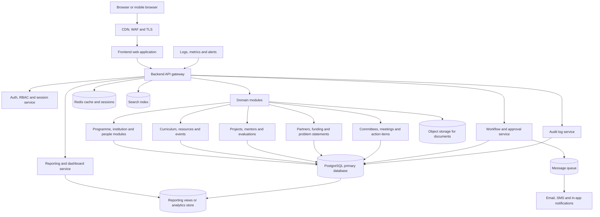

## 13.6 Domain Module Map

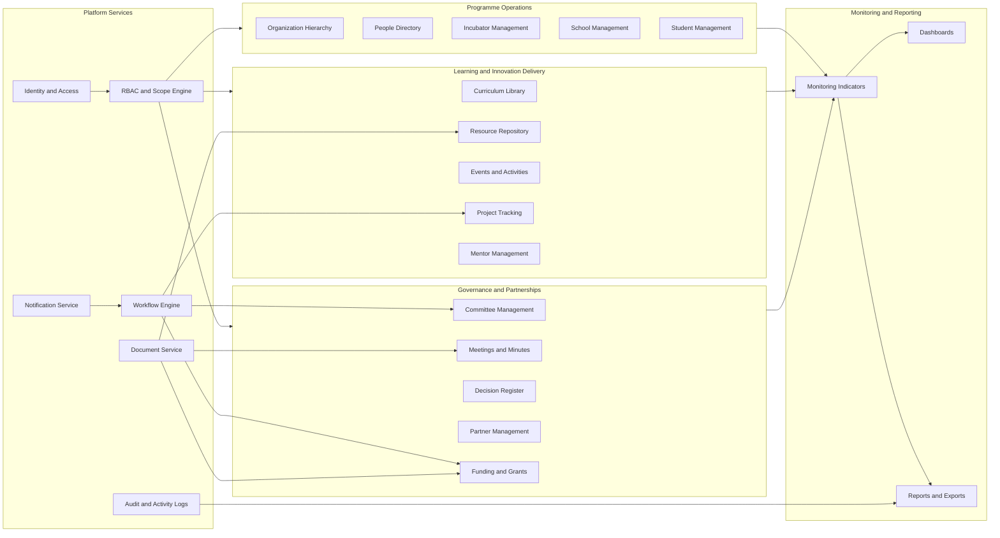

## 13.7 Data and Reporting Flow

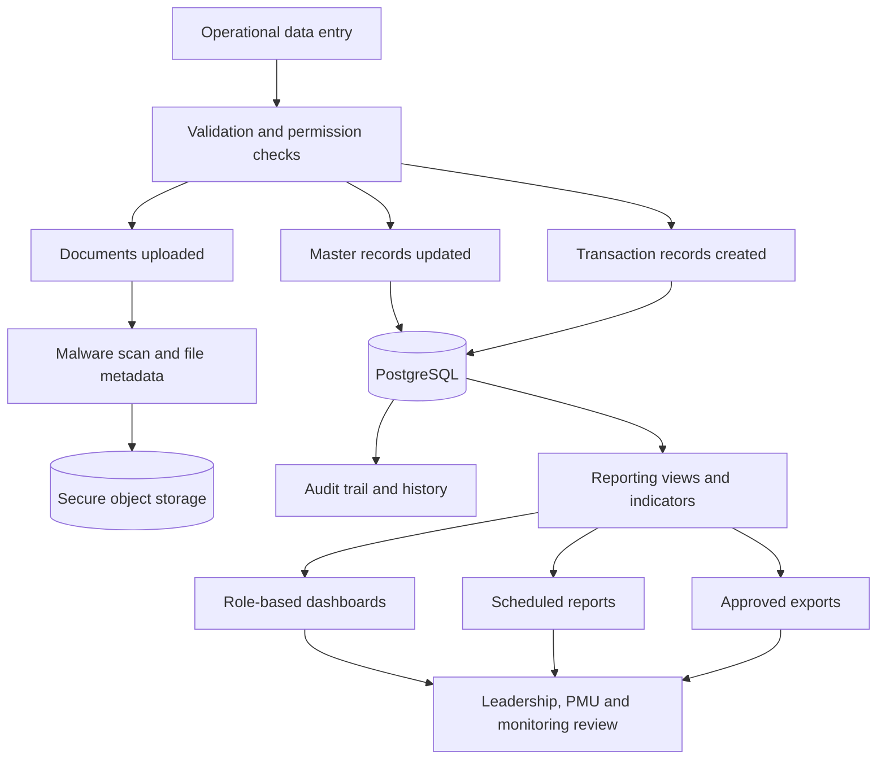

## 13.8 Deployment Architecture

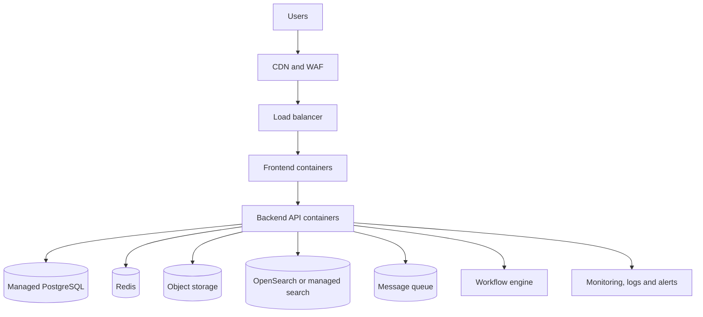

---

# 14. Recommended Tech Stack

## 14.1 Frontend

Recommended:

- Next.js
- React
- TypeScript
- Tailwind CSS
- shadcn/ui
- TanStack Query
- Zod
- React Hook Form

Reason:

- Scalable frontend framework
- Good dashboard development experience
- Strong type safety
- Good accessibility support
- Responsive web support
- Strong ecosystem

---

## 14.2 Backend

Recommended:

- NestJS
- TypeScript
- Prisma ORM
- REST APIs initially
- GraphQL selectively for complex dashboards

Reason:

- Enterprise-grade architecture
- Modular backend structure
- Type safety
- Strong RBAC support
- Easy testing
- Easy integration with queues and workflows

---

## 14.3 Database

Recommended:

- PostgreSQL

Reason:

- Strong relational model
- Reliable transactions
- Good for structured institutional data
- Supports JSONB for flexible fields
- Mature backup and replication
- Good indexing and reporting support

---

## 14.4 Cache

Recommended:

- Redis

Use cases:

- Session cache
- Rate limiting
- Dashboard cache
- Frequently accessed reference data
- OTP/MFA temporary storage
- Background job support

---

## 14.5 Search

Recommended:

- OpenSearch or Elasticsearch

Use cases:

- Global search
- Document metadata search
- Student search
- Project search
- Institution search
- Full-text search

---

## 14.6 Object Storage

Recommended:

- S3-compatible storage
- AWS S3, Azure Blob, GCP Storage, MinIO or government-approved equivalent

Use cases:

- Documents
- Curriculum files
- Student submissions
- Reports
- Certificates
- Images

---

## 14.7 Authentication

Recommended:

- Keycloak

Reason:

- Open-source identity provider
- Supports OIDC and SAML
- Supports MFA
- Supports SSO
- Supports role mapping
- Can integrate with government identity systems later

---

## 14.8 Workflow Engine

Recommended:

- Temporal or Camunda

Use cases:

- Approval flows
- Report review
- Committee decisions
- Funding review
- Project review
- Escalations
- Reminders

---

## 14.9 Queue

Recommended:

- RabbitMQ for MVP
- Kafka later if event scale becomes very high

Use cases:

- Notifications
- Email sending
- Report generation
- File processing
- Audit event streaming
- Background jobs

---

## 14.10 Analytics

Recommended:

- Metabase for quick internal analytics
- Apache Superset for advanced dashboards later
- Custom dashboards inside product for role-based views

---

## 14.11 DevOps

Recommended:

- Docker
- Kubernetes
- Helm
- GitHub Actions / GitLab CI
- ArgoCD
- Terraform
- Prometheus
- Grafana
- Loki / ELK
- OpenTelemetry

---

# 15. Scalability Strategy

## 15.1 Scaling Stages

### Stage 1: Pilot

- 50–100 schools
- Few thousand students
- Limited users
- Single-region deployment

### Stage 2: State Scale

- 300–500 schools
- Tens of thousands of students
- Multiple incubators
- More reporting load

### Stage 3: National Scale

- 2,000+ schools
- Lakhs of students
- Thousands of teachers
- Multiple partners
- Heavy dashboards and reports

## 15.2 Frontend Scaling

- CDN caching
- Static asset optimization
- Lazy loading
- Route-level code splitting
- Responsive UI
- Low-bandwidth mode

## 15.3 Backend Scaling

- Stateless API containers
- Horizontal pod autoscaling
- Queue-based background jobs
- Read replicas
- Modular service boundaries
- Rate limiting

## 15.4 Database Scaling

- Proper indexes
- Read replicas
- Partitioning for large tables
- Archival strategy
- Query optimization
- Materialized views for dashboards

## 15.5 File Scaling

- Store files in object storage
- Use signed URLs
- Virus scan uploads
- Lifecycle policies for old files
- Avoid storing files in database

## 15.6 Reporting Scaling

- Pre-aggregated metrics
- Dashboard caching
- Async report generation
- Data warehouse in later phase

---

# 16. Data Model Overview

## 16.1 Core Entities

- User
- Role
- Permission
- OrganizationUnit
- Committee
- Meeting
- Decision
- ActionItem
- Incubator
- School
- Student
- Teacher
- Mentor
- Partner
- FundingRecord
- Curriculum
- Resource
- Project
- ProblemStatement
- Event
- Report
- Document
- Notification
- AuditLog

## 16.2 Simplified Entity Relationship

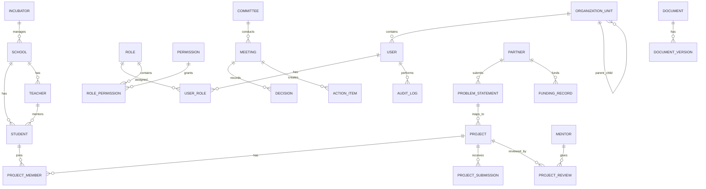

---

# 17. Security Architecture

## 17.1 Security Goals

The portal must protect:

- Student data
- Institutional data
- Governance documents
- Funding records
- Reports
- User credentials
- Audit trails

## 17.2 Security Principles

- Least privilege
- Defense in depth
- Zero trust
- Secure by default
- Encrypt sensitive data
- Audit important actions
- Minimize data collection
- Separate duties
- Regular security testing

## 17.3 Authentication Security

- MFA for admins and privileged users
- Strong password policy
- Account lockout
- Session timeout
- Refresh token rotation
- Device/session visibility
- Login anomaly detection later

## 17.4 Authorization Security

- Backend-enforced RBAC
- Attribute-based checks for institution scope
- No direct object access without ownership check
- Approval needed for privileged role assignment
- Regular access reviews

## 17.5 Data Security

### Data in Transit

- HTTPS everywhere
- TLS 1.2 minimum
- TLS 1.3 preferred
- Secure cookies
- HSTS enabled

### Data at Rest

- Database encryption
- Object storage encryption
- Encrypted backups
- Encrypted secrets
- Field-level encryption for highly sensitive fields

### Sensitive Data Handling

- Mask student personal data where possible
- Avoid unnecessary exposure of phone/email
- Track exports
- Restrict downloads
- Watermark sensitive reports in future

## 17.6 API Security

- API Gateway
- Rate limiting
- JWT validation
- RBAC middleware
- Input validation
- Output sanitization
- CORS restrictions
- Request logging
- Abuse detection

## 17.7 Application Security

- OWASP Top 10 mitigation
- Secure coding practices
- Dependency scanning
- Static code analysis
- Dynamic testing
- Penetration testing before production
- Secure file uploads
- Content Security Policy

## 17.8 File Security

- File type validation
- File size limits
- Virus/malware scanning
- Private object storage buckets
- Signed URLs
- Download logging
- Version history

## 17.9 Audit and Compliance

The system must maintain:

- Login logs
- Admin logs
- Export logs
- Access logs
- Approval logs
- Security event logs
- Data change logs

Audit logs should be immutable, searchable and exportable only by authorized users.

---

# 18. Backup and Disaster Recovery

## 18.1 Backup Strategy

- Daily automated database backups
- Point-in-time recovery
- Object storage backup
- Configuration backup
- Encrypted backups
- Regular restore testing

## 18.2 Suggested Targets

- MVP RPO: 24 hours
- MVP RTO: 8 hours
- Production RPO: 1 hour
- Production RTO: 2 hours

---

# 19. Privacy and Data Governance

## 19.1 Data Classification

Data should be classified as:

1. Public
2. Internal
3. Confidential
4. Restricted

## 19.2 Restricted Data

Restricted data includes:

- Student personal data
- Guardian data
- Private institutional data
- Funding records
- Governance documents
- Audit logs
- User credentials
- Security configuration

## 19.3 Consent and Notice

Where student data is collected, the system should support:

- Consent capture
- Guardian consent if required
- Privacy notice
- Data use declaration
- Data correction process

---

# 20. Non-Functional Requirements

## 20.1 Performance

- Common page load under 3 seconds
- Dashboard load under 5 seconds with cached data
- Search results under 2 seconds for common queries
- Heavy reports generated asynchronously

## 20.2 Availability

- MVP target: 99.5%
- Production target: 99.9%
- Health checks
- Auto restart
- Planned maintenance mode

## 20.3 Reliability

- Retry mechanisms
- Idempotent APIs
- Graceful failure handling
- Data validation at all layers

## 20.4 Usability

- Responsive web design
- Simple school/student interface
- Low bandwidth support
- Clear navigation
- Multilingual-ready structure
- Accessibility-friendly UI

## 20.5 Maintainability

- Modular codebase
- TypeScript across frontend/backend
- Automated tests
- API documentation
- Code review process
- Environment-based configuration

## 20.6 Observability

- Metrics
- Logs
- Traces
- Error reporting
- Uptime monitoring
- User activity monitoring
- Business KPI monitoring

---

# 21. Workflow and Approval System

## 21.1 Workflows Required

- User approval
- School approval
- Incubator approval
- Curriculum approval
- Problem statement approval
- Project review
- Funding document approval
- Report approval
- Committee decision approval

## 21.2 Generic Approval Flow

```mermaid
flowchart TD
A[Draft Created] --> B[Submitted]
B --> C[Reviewer Assigned]
C --> D{Approved?}
D -->|Yes| E[Published or Accepted]
D -->|No| F[Returned for Revision]
F --> A
E --> G[Archived Later]
```

## 21.3 Maker-Checker Flow

```mermaid
flowchart TD
A[Maker Creates Request] --> B[System Validates]
B --> C[Checker Reviews]
C --> D{Decision}
D -->|Approve| E[Action Executed]
D -->|Reject| F[Request Rejected]
E --> G[Audit Log Created]
F --> G
```

---

# 22. API Strategy

## 22.1 API Principles

- API-first design
- REST for standard CRUD
- GraphQL only where useful
- OpenAPI documentation
- Versioned APIs
- Secure by default
- Consistent error format
- Pagination
- Filtering and sorting
- Audit logging for sensitive APIs

## 22.2 API Categories

- Auth APIs
- User APIs
- Role APIs
- Institution APIs
- Student APIs
- Curriculum APIs
- Project APIs
- Partner APIs
- Funding APIs
- Report APIs
- Document APIs
- Notification APIs
- Audit APIs

---

# 23. Integration Strategy

## 23.1 Initial Integrations

- Email service
- SMS gateway
- WhatsApp notification provider
- Object storage
- Identity provider
- Analytics dashboard

## 23.2 Future Integrations

- Government SSO
- Document verification systems
- LMS systems
- Video platforms
- BI tools
- Data warehouse
- AI assistant
- External survey tools

---

# 24. Deployment Strategy

## 24.1 Environments

- Local
- Development
- Staging
- UAT
- Production
- Disaster Recovery

## 24.2 CI/CD

- Code pushed to repository
- Automated linting
- Automated tests
- Security scan
- Docker build
- Deploy to staging
- Approval gate
- Deploy to production

## 24.3 Release Strategy

- Feature flags
- Versioned releases
- Rollback support
- Database migration strategy
- Maintenance mode support

---

# 25. Monitoring and Observability

## 25.1 Technical Monitoring

- CPU
- Memory
- Disk
- Network
- API latency
- Error rate
- Database load
- Queue length
- Job failures

## 25.2 Business Monitoring

- Active users
- Login frequency
- Report submission rate
- Project submission rate
- Curriculum access
- Pending approvals
- Overdue tasks
- Institution activity

## 25.3 Alerts

- System downtime
- High error rate
- Failed backups
- Security events
- Suspicious login attempts
- High database load
- Queue backlog
- Report generation failures

---

# 26. Data Import and Migration

## 26.1 Import Requirements

The system should support bulk imports for:

- Users
- Schools
- Incubators
- Students
- Mentors
- Curriculum
- Resources
- Projects
- Partners

## 26.2 Import Format

- CSV
- XLSX
- JSON for technical imports

## 26.3 Import Validation

- Required field validation
- Duplicate detection
- Email/phone validation
- Institution mapping validation
- Error report generation
- Preview before final import

---

# 27. Search Requirements

## 27.1 Global Search

Users should be able to search across permitted data:

- People
- Schools
- Incubators
- Students
- Projects
- Documents
- Meetings
- Tasks
- Partners
- Reports

## 27.2 Search Security

Search must respect access control. Users should never discover unauthorized records through search results.

---

# 28. AI-Ready Future Scope

The platform should be designed so AI features can be added later.

Possible AI features:

- AI report generator
- AI meeting summary
- AI project feedback assistant
- AI curriculum recommendation
- AI risk detection
- AI mentor matching
- AI dashboard insights
- AI document search
- AI translation for regional languages

AI should not be a core dependency for MVP.

---

# 29. Development Roadmap

## 29.1 Phase 0: Discovery and Design

- Finalize requirements
- Confirm roles
- Confirm workflows
- Create wireframes
- Define data model
- Define security model
- Create implementation plan

## 29.2 Phase 1: MVP

- Auth and RBAC
- User management
- Organization hierarchy
- Incubator management
- School management
- Student management
- Curriculum/resources
- Project tracking
- Document repository
- Basic dashboards
- Reports
- Audit logs

## 29.3 Phase 2: Workflow and Scale

- Advanced approvals
- Committee management
- Meeting management
- Funding management
- Industry partner module
- Advanced reporting
- Notification engine
- Search engine
- Bulk imports
- M&E workflows

## 29.4 Phase 3: National Scale

- Advanced analytics
- Data warehouse
- AI features
- Mobile app
- Offline support
- External integrations
- Public impact portal
- Multilingual content

---

# 30. MVP User Stories

## 30.1 Authentication

- As a user, I want to log in securely so that I can access the portal.
- As an admin, I want to assign roles so that users get correct access.
- As a privileged user, I want MFA so that my account is protected.

## 30.2 User Management

- As a PMU admin, I want to create users so that stakeholders can access the portal.
- As an admin, I want to deactivate users so that former users cannot access data.
- As an admin, I want to bulk upload users so that onboarding is faster.

## 30.3 Institution Management

- As a PMU user, I want to create incubators so that I can manage implementation partners.
- As a PMU user, I want to map schools to incubators so that accountability is clear.
- As an incubator admin, I want to view my schools so that I can manage them.

## 30.4 Student Management

- As a teacher, I want to add students so that they can access the portal.
- As a student, I want to view my curriculum so that I know what to learn.
- As a PMU admin, I want to view student counts by school so that I can monitor reach.

## 30.5 Project Tracking

- As a student, I want to create a project so that I can submit my work.
- As a mentor, I want to review assigned projects so that I can guide students.
- As a teacher, I want to track project status so that I can support students.

## 30.6 Reporting

- As a PMU user, I want dashboards so that I can monitor progress.
- As a school admin, I want to submit reports so that the PMU has updated data.
- As a leadership user, I want high-level dashboards so that I can make decisions.

## 30.7 Document Management

- As a user, I want to upload documents so that records are stored centrally.
- As an admin, I want document permissions so that sensitive files are protected.
- As a user, I want document versioning so that old and new versions are traceable.

---

# 31. Risks and Mitigation

| Risk | Impact | Mitigation |
|---|---|---|
| Low adoption by schools | High | Simple UI, training, onboarding support |
| Data quality issues | High | Validation, bulk import checks, approval workflows |
| Security breach | Very High | MFA, RBAC, encryption, audit logs, pen testing |
| Over-complex MVP | High | Modular phase-wise rollout |
| Poor internet in schools | Medium | Lightweight UI, low-bandwidth mode, future offline support |
| Role confusion | Medium | Clear RBAC matrix and onboarding |
| Reporting overload | Medium | Standard templates and automated reports |
| Scalability issues | High | Cloud-native deployment and database optimization |
| Unauthorized data exports | High | Export permissions, audit logs, watermarking |
| Vendor lock-in | Medium | Open-source-first architecture where possible |

---

# 32. Acceptance Criteria for MVP

The MVP will be considered successful if:

1. Admin can create and manage users.
2. Roles and permissions work correctly.
3. Incubators and schools can be created and mapped.
4. Students can be onboarded and linked to schools.
5. Curriculum/resources can be uploaded and viewed by students.
6. Projects can be created, tracked and reviewed.
7. Basic dashboards show real-time metrics.
8. Reports can be generated and exported.
9. Documents can be uploaded with access control.
10. Audit logs capture major actions.
11. System supports secure login and MFA for admins.
12. Data access is correctly restricted by role and institution.

---

# 33. Open Questions

These should be clarified before implementation:

1. Will the platform be hosted on public cloud, government cloud or on-prem infrastructure?
2. Is government SSO required from day one?
3. Is student guardian consent required during onboarding?
4. What is the expected user count for the first year?
5. Will schools upload students manually or through bulk import?
6. Should the platform support multiple languages in MVP?
7. Will funding records be official financial records or only tracking metadata?
8. What reports are mandatory for leadership review?
9. Who approves curriculum before publication?
10. Who owns final data governance policy?
11. What is the required audit log retention period?
12. Should external partners access the same portal or a separate partner portal?
13. Is mobile app required or responsive web enough initially?

---

# 34. Final Recommendation

The portal should be built as a secure, modular, scalable web application with strong role-based access control, centralized data management, auditable workflows and real-time dashboards.

Recommended approach:

- Build MVP as a modular monolith using Next.js, NestJS and PostgreSQL.
- Use Keycloak for authentication and RBAC.
- Use object storage for documents.
- Use Redis for caching and background jobs.
- Use OpenSearch for search.
- Use Kubernetes-ready infrastructure from the beginning.
- Implement strict audit logging and data security controls.
- Keep the system API-first and integration-ready.
- Scale gradually from pilot to state-level to national-level deployment.

The first version should focus on becoming a reliable operational system. Advanced AI, mobile apps and complex analytics can be added after the core workflows and data model are stable.

---

# Appendix A: Suggested Initial Module Priority

| Priority | Module | Reason |
|---|---|---|
| P0 | Auth & RBAC | Foundation of secure access |
| P0 | User Management | Required for all workflows |
| P0 | Organization Hierarchy | Required to map institutions |
| P0 | Incubator & School Management | Core operational structure |
| P0 | Student Management | Core beneficiary tracking |
| P0 | Curriculum & Resources | Student-facing value |
| P0 | Project Tracking | Core innovation workflow |
| P1 | Dashboards | Management visibility |
| P1 | Reports | Review and monitoring |
| P1 | Document Repository | Central source of truth |
| P1 | Audit Logs | Government-grade accountability |
| P2 | Committee Management | Governance workflow |
| P2 | Funding Management | Partner and grant tracking |
| P2 | Advanced M&E | Impact evaluation |
| P3 | AI Features | Future enhancement |

---

# Appendix B: Suggested Initial Database Tables

- users
- roles
- permissions
- user_roles
- role_permissions
- organization_units
- incubators
- schools
- students
- teachers
- mentors
- partners
- committees
- committee_members
- meetings
- meeting_minutes
- decisions
- action_items
- curriculum_items
- resources
- projects
- project_members
- project_submissions
- project_reviews
- problem_statements
- events
- event_participants
- funding_records
- reports
- documents
- document_versions
- notifications
- audit_logs

---

# Appendix C: Suggested Permissions

- user.read
- user.create
- user.update
- user.delete
- role.manage
- institution.read
- institution.create
- institution.update
- student.read
- student.create
- student.update
- student.export
- curriculum.read
- curriculum.create
- curriculum.publish
- project.read
- project.create
- project.review
- project.approve
- report.read
- report.create
- report.export
- document.read
- document.upload
- document.approve
- funding.read
- funding.update
- committee.read
- committee.manage
- audit.read
- system.manage

---

# Appendix D: Next Steps

1. Review this overview document.
2. Finalize user roles and permissions.
3. Finalize MVP module list.
4. Create wireframes.
5. Create detailed database schema.
6. Create API specification.
7. Create sprint-wise development plan.
8. Create security checklist.
9. Create deployment plan.
10. Start MVP implementation.
