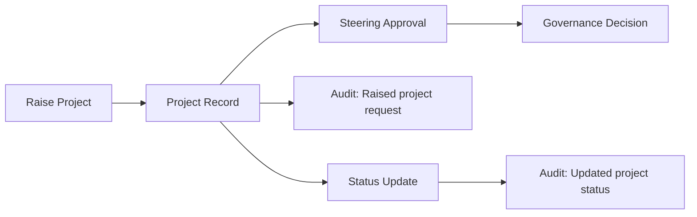

# FundOS-Aligned Sitemap, Flow and UX

## FundOS Component Patterns Reviewed

Source reviewed from `Yash121l/FundOS`:

- `apps/web/src/components/shell/sidebar.tsx`: fixed compact sidebar, grouped navigation, 30px nav rows, badges only where operationally useful.
- `apps/web/src/components/shell/topbar.tsx`: slim 56px topbar with route title, command search entry and user menu.
- `apps/web/src/components/portfolio/portfolio-table.tsx`: searchable/filterable dense table, clickable identity rows and detail navigation.
- `apps/web/src/app/(shell)/portfolio/[id]/page.tsx` plus `company-header.tsx`: full detail page with back breadcrumb, identity header, status, metric strip and tabs.
- `apps/web/src/components/updates/inbox.tsx` plus `review-sheet.tsx`: inbox/review work opens in a right-side sheet instead of replacing the list.

SCP should use these as product and interaction patterns, not copied fund-domain code.

## Role Sitemap

| Role | Sidebar Modules |
|---|---|
| Government main | Dashboard, Incubators, Schools, Employees, Students, Projects, Governance, Audit, Profile |
| Steering committee | Dashboard, Incubators, Schools, Students, Projects, Governance, Audit, Profile |
| Incubator | Dashboard, Schools, Employees, Students, Projects, Governance, Profile |
| Incubator employee | Dashboard, Schools, Students, Projects, Profile |
| School | Dashboard, Students, Projects, Profile |
| Student | Dashboard, Projects, Profile |

The UI sitemap is role-specific first and permission-checked second. This avoids scoped users seeing global indexes such as an Incubator user seeing the Incubators tab.

## Primary Flows

### Government Main

Dashboard -> Incubators -> New Incubator -> Incubator Detail -> New School -> School Detail -> New Employee / New Student -> Record Detail.

Project workflow: Dashboard -> Projects -> New Project -> Project Detail -> Governance approval -> Status update -> Audit log.

### Incubator

Dashboard -> Schools -> New School -> School Detail -> Students -> New Student -> Student Detail -> Projects -> New Project -> Project Detail.

### School

Dashboard -> Students -> New Student -> Student Detail -> Projects -> New Project -> Project Detail.

### Student

Dashboard -> Projects -> New Project -> Project Detail -> Profile. Student detail data is scoped to the signed-in student and reached through dashboard/profile links, not a global student index.

## Project Request Flow

## UX Rules

- List pages are indexes, not forms.
- Add actions open `/new` route pages.
- Create actions redirect to the created record detail where the API returns an ID.
- Detail pages use a record header, metrics strip and tab-style local section nav.
- Project detail pages expose a compact status update control for permitted roles and keep the project owner, school, incubator, approval ID and timestamps visible.
- Review queues and approval decisions may use slide-over panels later, matching FundOS Updates, but master-data creation should stay route-level.
- The shell should remain dense: black background, thin borders, compact row heights, small titles and operational language.
